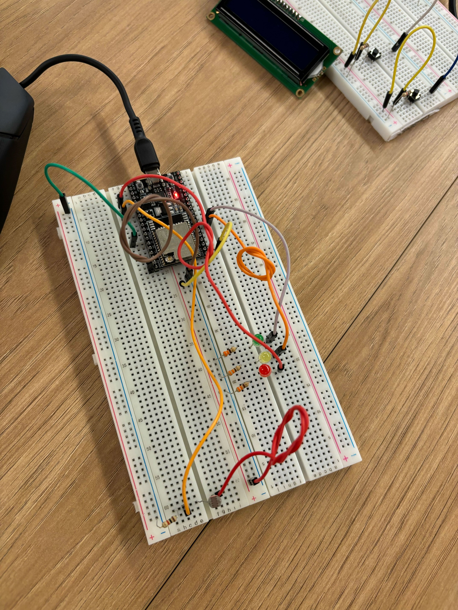
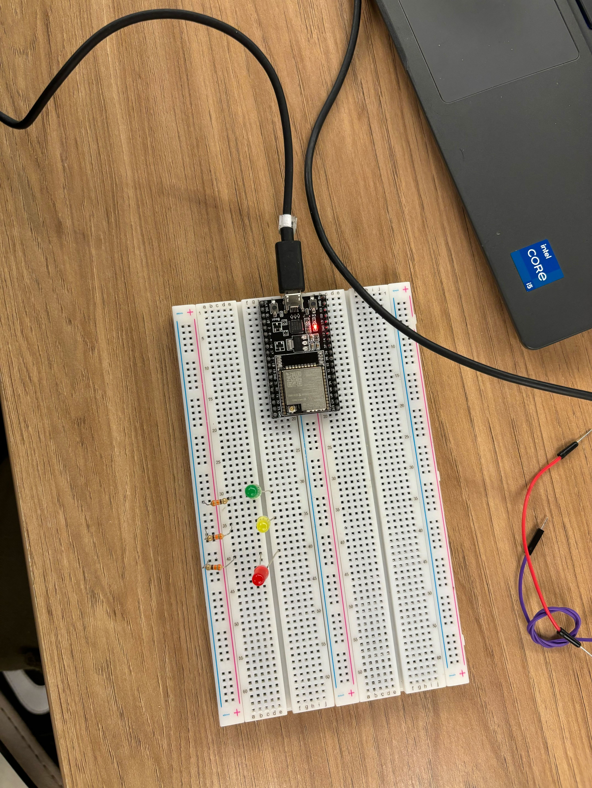

# Semáforo Inteligente com Sensor LDR e Integração ao Ubidots

## Índice

- [Introdução](#introdução)
- [Objetivos](#objetivos)
- [Materiais Necessários](#materiais-necessários)
- [Parte 1: Montagem Física e Programação com LDR e Modo Noturno](#parte-1-montagem-física-e-programação-com-ldr-e-modo-noturno)
  - [Esquema Elétrico](#esquema-elétrico)
  - [Montagem Passo a Passo](#montagem-passo-a-passo)
  - [Código Fonte](#código-fonte)
  - [Explicação do Código](#explicação-do-código)
- [Parte 2: Configuração da Interface Online](#parte-2-configuração-da-interface-online)
  - [Criação da Interface](#criação-da-interface)
  - [Funcionalidades Implementadas](#funcionalidades-implementadas)
  - [Imagens da Interface](#imagens-da-interface)
- [Extra: Implementar um Circuito com ESP32 para Cada Semáforo e Conectá-los ao Ubidots](#extra-implementar-um-circuito-com-esp32-para-cada-semáforo-e-conectá-los-ao-ubidots)
  - [Configuração do ESP32](#configuração-do-esp32)
  - [Conexão ao Ubidots](#conexão-ao-ubidots)
  - [Dashboard no Ubidots](#dashboard-no-ubidots)
- [Resultados e Testes](#resultados-e-testes)
  - [Funcionamento do Semáforo Inteligente](#funcionamento-do-semáforo-inteligente)
  - [Vídeo Demonstrativo](#vídeo-demonstrativo)
- [Conclusão](#conclusão)
- [Referências](#referências)

---

## Introdução

Nesta documentação, apresentamos o desenvolvimento de um **semáforo inteligente** utilizando um sensor de luz (LDR) e integração com uma interface online e o Ubidots. O objetivo é simular como semáforos podem se comunicar e ajustar o fluxo de veículos em uma Smart City.

## Objetivos

- Montar dois semáforos com sensor LDR para detectar a presença de veículos.
- Implementar o modo noturno baseado na luminosidade ambiente.
- Criar uma interface online para controle e visualização dos semáforos.
- Integrar os semáforos com ESP32 ao Ubidots para monitoramento centralizado.

## Materiais Necessários

- 2 x Placas ESP32
- LEDs (vermelho, amarelo, verde) ou módulos de semáforo
- 1 x Sensor LDR
- Resistores variados (10kΩ para o LDR, outros conforme necessário)
- Protoboard e jumpers
- Computador com Arduino IDE instalado
- Conta no Ubidots
- Conexão Wi-Fi

## Parte 1: Montagem Física e Programação com LDR e Modo Noturno

### Esquema Elétrico

A seguir, o esquema elétrico da montagem dos semáforos com o sensor LDR:



### Montagem Passo a Passo

1. **Conexão dos LEDs:**
   - Conecte os LEDs nos seguintes pinos do ESP32:
     - **LED Verde:** pino 12
     - **LED Amarelo:** pino 13
     - **LED Vermelho:** pino 14
   - Utilize resistores adequados para proteger os LEDs.

2. **Conexão do Sensor LDR:**
   - Conecte um terminal do LDR ao **3.3V** do ESP32.
   - Conecte o outro terminal ao pino analógico **VP (GPIO 36)**.
   - Adicione um resistor de **10kΩ** entre o pino analógico e o **GND** para formar um divisor de tensão.

3. **Verificação das Conexões:**
   - Certifique-se de que todas as conexões estão corretas.
   - Verifique a polaridade dos LEDs.

Foto da montagem física:



### Código Fonte

```cpp
// Configuração dos LEDs
const int ledVerde = 12;
const int ledAmarelo = 13;
const int ledVermelho = 14;

// Configuração do Sensor LDR
const int sensorLDR = 36; // Pino VP (GPIO 36)

// Classe Semaforo
class Semaforo {
  private:
    int ledVerde, ledAmarelo, ledVermelho;
    bool cicloAberto; // Estado do ciclo (aberto ou fechado)
    
  public:
    // Construtor
    Semaforo(int lv, int la, int lr) 
      : ledVerde(lv), ledAmarelo(la), ledVermelho(lr), cicloAberto(true) {
      pinMode(ledVerde, OUTPUT);
      pinMode(ledAmarelo, OUTPUT);
      pinMode(ledVermelho, OUTPUT);
    }

    // Métodos de controle do semáforo
    void sinalVermelho() {
      digitalWrite(ledVerde, LOW);
      digitalWrite(ledAmarelo, LOW);
      digitalWrite(ledVermelho, HIGH);
    }

    void sinalAmarelo() {
      digitalWrite(ledVerde, LOW);
      digitalWrite(ledVermelho, LOW);
      digitalWrite(ledAmarelo, HIGH);
      delay(500);
      digitalWrite(ledAmarelo, LOW);
      delay(500);
    }

    void sinalVerde() {
      digitalWrite(ledVermelho, LOW);
      digitalWrite(ledAmarelo, LOW);
      digitalWrite(ledVerde, HIGH);
      delay(2000);
      digitalWrite(ledVerde, LOW);
    }

    // Verifica e alterna o ciclo
    void verifyCycle() {
      if (cicloAberto) {
        // Executa o ciclo de sinal amarelo e verde
        sinalAmarelo();
        sinalVerde();
      } else {
        // Mantém o sinal vermelho
        sinalVermelho();
      }
    }

    // Métodos para alternar o ciclo manualmente (simulando controle externo)
    void abrirCiclo() {
      cicloAberto = true;
    }

    void fecharCiclo() {
      cicloAberto = false;
    }
};

Semaforo semaforo(ledVerde, ledAmarelo, ledVermelho); // Instância do semáforo

void setup() {
  Serial.begin(115200);
  semaforo.fecharCiclo(); // Inicializa o semáforo no sinal vermelho
  pinMode(sensorLDR, INPUT);
}

void loop() {
  int valorLDR = analogRead(sensorLDR);
  Serial.println(valorLDR);

  if (valorLDR < 1000) { // Ajuste este valor conforme a luminosidade ambiente
    // Modo noturno: pisca o amarelo
    semaforo.sinalAmarelo();
  } else {
    semaforo.verifyCycle();
    delay(1000);

    // Simulação para alternar o ciclo
    semaforo.abrirCiclo(); // Abre o ciclo para que o semáforo passe ao amarelo e verde
    delay(8000);           // Tempo de teste entre os ciclos
    semaforo.fecharCiclo(); // Fecha o ciclo para que o semáforo fique no vermelho
  }
}
```

### Explicação do Código

- **Definição dos pinos:** Os pinos dos LEDs e do sensor LDR são definidos no início do código.
- **Classe `Semaforo`:** Encapsula o comportamento do semáforo, facilitando a manutenção e a expansão do código.
  - **Atributos:**
    - `ledVerde`, `ledAmarelo`, `ledVermelho`: Armazenam os pinos correspondentes.
    - `cicloAberto`: Indica se o semáforo está no ciclo normal ou parado no vermelho.
  - **Métodos:**
    - `sinalVermelho()`: Acende o LED vermelho.
    - `sinalAmarelo()`: Pisca o LED amarelo.
    - `sinalVerde()`: Acende o LED verde por um período definido.
    - `verifyCycle()`: Controla o fluxo dos sinais baseado no estado do ciclo.
    - `abrirCiclo()` e `fecharCiclo()`: Alteram o estado do ciclo.
- **Função `setup()`:** Inicializa a comunicação serial, configura o semáforo para iniciar no vermelho e define o pino do LDR como entrada.
- **Função `loop()`:**
  - **Leitura do LDR:** Lê o valor analógico do sensor LDR.
  - **Condicional do Modo Noturno:** Se a luminosidade estiver abaixo do limiar definido, o semáforo entra em modo noturno, piscando o amarelo.
  - **Ciclo Normal:** Caso contrário, o semáforo executa o ciclo normal.
  - **Simulação de Controle Externo:** Alterna entre abrir e fechar o ciclo para simular o controle externo ou a passagem do tempo.

## Parte 2: Configuração da Interface Online

### Criação da Interface

Desenvolvemos uma interface online utilizando o **Ubidots** para monitorar e controlar o semáforo remotamente. A interface permite visualizar o valor do sensor LDR e alterar o estado do semáforo.

### Funcionalidades Implementadas

- **Monitoramento em Tempo Real:** Visualização dos dados do LDR e do estado dos LEDs.
- **Controle Remoto:** Possibilidade de alterar o estado do ciclo do semáforo (aberto ou fechado).
- **Alertas:** Notificações em caso de baixa luminosidade (modo noturno ativado).

### Imagens da Interface


## Extra: Implementar um Circuito com ESP32 para Cada Semáforo e Conectá-los ao Ubidots

### Configuração do ESP32

Para conectar o ESP32 ao Ubidots, utilizamos a biblioteca **WiFi.h** e **PubSubClient.h** para comunicação MQTT.

```cpp
#include <WiFi.h>
#include <PubSubClient.h>

// Configurações da rede Wi-Fi
const char* ssid = "Nome_da_Rede";
const char* password = "Senha_da_Rede";

// Configurações do Ubidots
const char* mqttServer = "things.ubidots.com";
const int mqttPort = 1883;
const char* token = "Seu_Token_Ubidots";
const char* clientID = "ESP32_Semaforo";

WiFiClient espClient;
PubSubClient client(espClient);

void setup_wifi() {
  delay(10);
  Serial.println();
  Serial.print("Conectando-se a ");
  Serial.println(ssid);

  WiFi.begin(ssid, password);

  while (WiFi.status() != WL_CONNECTED) {
    delay(500);
    Serial.print(".");
  }

  Serial.println("");
  Serial.println("WiFi conectado");
}

void reconnect() {
  while (!client.connected()) {
    Serial.print("Tentando se conectar ao MQTT...");
    if (client.connect(clientID, token, "")) {
      Serial.println("Conectado");
    } else {
      Serial.print("Falha, rc=");
      Serial.print(client.state());
      Serial.println(" Tentando novamente em 5 segundos");
      delay(5000);
    }
  }
}

void setup() {
  Serial.begin(115200);
  setup_wifi();
  client.setServer(mqttServer, mqttPort);
  // Inicialização do semáforo
}

void loop() {
  if (!client.connected()) {
    reconnect();
  }
  client.loop();

  int valorLDR = analogRead(sensorLDR);
  char payload[100];
  sprintf(payload, "{\"LDR\":%d}", valorLDR);

  client.publish("/v1.6/devices/semaforo", payload);

  // Código do semáforo
}
```

### Conexão ao Ubidots

- **Configuração da Rede Wi-Fi:** Definimos o SSID e a senha da rede.
- **Configuração do MQTT:** Utilizamos as credenciais do Ubidots para estabelecer a conexão MQTT.
- **Publicação dos Dados:** Enviamos os valores do LDR e o estado do semáforo para o Ubidots.

### Dashboard no Ubidots

Criamos um dashboard no Ubidots para visualizar os dados dos semáforos conectados.


## Resultados e Testes

### Funcionamento do Semáforo Inteligente

- **Detecção de Luminosidade:** O sensor LDR detecta a variação de luminosidade, permitindo a mudança para o modo noturno.
- **Modo Noturno:** Quando a luminosidade cai abaixo do valor definido, o semáforo entra em modo noturno, piscando o LED amarelo.
- **Comunicação com o Ubidots:** Os dados do LDR e o estado do semáforo são enviados para o Ubidots, permitindo o monitoramento remoto.
- **Controle Remoto:** Através da interface online, é possível alterar o estado do ciclo do semáforo.

### Vídeo Demonstrativo

Assista ao vídeo demonstrativo do projeto [aqui](#).

## Conclusão

O projeto demonstrou com sucesso a implementação de um semáforo inteligente utilizando um sensor LDR e integração com uma plataforma IoT. A utilização de uma classe para o semáforo tornou o código mais organizado e modular. A conexão com o Ubidots permitiu o monitoramento e controle remoto, características essenciais em uma Smart City.

## Referências

- [Documentação do ESP32](https://www.espressif.com/en/products/socs/esp32/resources)
- [Ubidots Documentation](https://ubidots.com/docs/hw/)
- [Arduino IDE](https://www.arduino.cc/en/Main/Software)
- [Biblioteca PubSubClient](https://github.com/knolleary/pubsubclient)

---

*Este projeto foi desenvolvido como parte de uma atividade acadêmica para explorar conceitos de IoT e cidades inteligentes.*